# Yongho Ahn

AI Software Engineering undergraduate at Soongsil University.

I build **on-device AI, edge systems, Android applications, and embedded/ML prototypes**.  
My main interests are efficient AI deployment, real-time intelligent systems, and software that connects models to actual devices.

## Areas of interest

- On-device & Edge AI
- Android / Kotlin / Java
- PyTorch / ONNX
- Embedded Systems / FPGA / AI Accelerators
- ROS 2 / Robotics
- Real-time ML systems

## Selected work

- **Adaptive parametric EQ / audio ML** — real-time room-response compensation and tonal-shape tracking
- **On-device anti-scam AI** — speech/context understanding and spoofed-voice detection on Android
- **Edge AI systems** — embedded inference, robotics, and accelerator-oriented deployment
- **Android applications** — mobile development experience since 2013
- **Game / simulation prototypes** — Godot and Unity projects alongside systems work

## GitHub stats

<picture>
  <source media="(prefers-color-scheme: dark)" srcset="./profile/stats-dark.svg">
  <source media="(prefers-color-scheme: light)" srcset="./profile/stats-light.svg">
  
</picture>

<picture>
  <source media="(prefers-color-scheme: dark)" srcset="./profile/top-langs-dark.svg">
  <source media="(prefers-color-scheme: light)" srcset="./profile/top-langs-light.svg">
  
</picture>

---

Currently focused on **efficient on-device inference, embedded AI, and real-world ML systems**.
